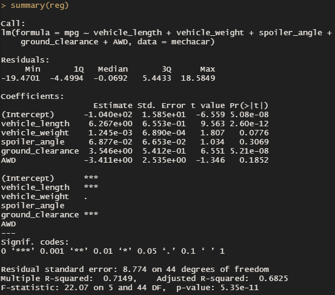
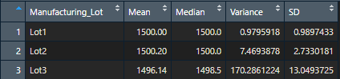
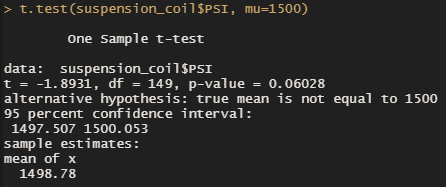
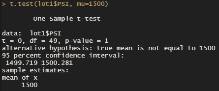
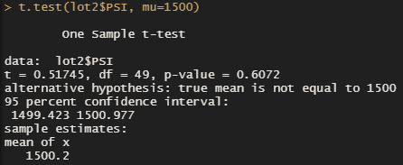
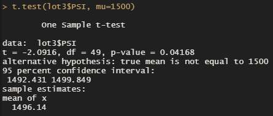

# MechaCar Statistical Analysis

## Overview of the MechaCar Statistical Analysis

AutosRUs’ newest prototype, the MechaCar, is suffering from production troubles that are blocking the manufacturing team’s progress. AutosRUs’ upper management has called on the data analytics team to review the production data for insights that may help the manufacturing team.

## Resources
- Data Source: MechaCar_mpg.csv, Suspension_Coil.csv
- Software: R 4.1.2, RStudio 2021.09.1

## Linear Regression to Predict MPG

With the given datasets we are able to create the following linear regression model to predict the MechaCar prototype’s miles per gallon based on the vehicle specifications:

Resulting Model: mpg ≈ (6.267)vehicle_length + (0.001)vehicle_weight + (0.069)spoiler_angle + (3.546)ground_clearance + (-3.411)AWD + (-104.0)

From the linear regression model we can accurately answer the following questions:

1) Which variables/coefficients provided a non-random amount of variance to the mpg values in the dataset?

- The vehicle length, and vehicle ground clearance are statistically likely to provide non-random amounts of variance to the model. Specifically, the vehicle length and ground clearance have a significant impact on miles per gallon on the MechaCar prototype, as indicated by their p-values . On the other hand, the other variables have p-values that indicate a random amount of variance with the dataset.

2) Is the slope of the linear model considered to be zero? Why or why not?

- The p-value for this model, 5.35e-11, is much smaller than the assumed significance level of 0.05%. This indicates there is sufficient evidence to reject the null hypothesis, and that the slop of this linear model would not be zero. Although, it should be noted this answer remains the same if we were using only the vehicle length and ground clearance variables to create this linear regression model, but the same can not be said if it was modelled using only the other variables.

3) Does this linear model predict mpg of MechaCar prototypes effectively? Why or why not?

- This linear model has an r-squared value of 0.7149. This means that approximately 71% of all mpg predictions will be determined by this model. With an r-squared value this high, relatively speaking, this linear model does predict mpg of MechaCar prototypes effectively.

## Summary Statistics on Suspension Coils

The design specifications for the MechaCar suspension coils dictate that the variance of the suspension coils must not exceed 100 pounds per square inch. We can use the statistics below to determine if the current manufacturing data meet this design specification.

Overall summary:

Lot specific summary:

When looking at the total from all three manufacturing lots, the variance of the coils is approximately 62.29 PSI, which is well within the 100 PSI variance requirement. Similarly, and even more consistently, Lot 1 and Lot 2 are well within the 100 PSI variance requirement with variances of approximately 0.98 and 7.47 respectively. However, when looking at Lot 3 individually, we can see that Lot 3 shows a variance of approximately 170.29 which fails to meet the design specification.  We can also conclude that it is Lot 3 that is disproportionately impacting the overall variance level when looking at all three lots combined.

## T-Tests on Suspension Coils

Performing a t-test on the suspension coil data, to determine whether there is a statistical difference between the mean of this provided sample dataset and a hypothesized potential population dataset, using a presumed population mean of 1500, we find the following results:

Across all manufacturing lots:

With this t-test we can see that the true mean of the sample is 1498.78, which is confirmed in the summary statistics above. The t-test also shows a p-value of over 0.06, which is higher than the assumed significance level of 0.05. Suffice it to say, there is not enough evidence to reject the null hypothesis. Therefore, the mean of all three manufacturing lots is statistically similar to the presumed population mean of 1500. 

However, if we look at t-test results for the three lots individually we find the following results:

For Lot 1:

For Lot 2:

For Lot 3:

The Lot 1 sample actually shows a true sample mean of 1500, meaning it also has a p-value equal to 1. Clearly we cannot reject the null hypothesis that there is no statistical difference between the observed sample mean and the presumed population mean for Lot 1.
The Lot 2 sample has a sample mean of 1500.02, and a p-value of approximately 0.61. Similar to Lot 1, we cannot reject the null hypothesis in Lot 2 either.
The Lot 3 sample, not surprisingly, does not provide the same insight. With Lot 3 the sample mean is 1496.14 with a p-value of approximately 0.04, which is lower than the common significance level of 0.05. This information indicates that we can reject the null hypothesis that this sample mean and the presumed population mean are not statistically different.

## Conclusion

In conclusion, we can see that something has gone wrong in the production cycle of Lot 3. The process should be reviewed, and the suspension coils from Lot 3 require inspection in order to remove those that do not meet the qualifying criteria.

## Study Design: MechaCar vs Competition

A statistical study design has the following:
- A described null hypothesis, and an alternative hypothesis
- A statistical test to test the hypothesis
- Metrics to be tested
- Data required to run the statistical test

For this study we can collect data from MechaCar as well as similar products from competing manufacturers over the last few years. We can study the metrics behind Current Price (the dependent variable) and Engine, MPG, Safety Feature Rating, Resale Value, Average Maintenance Cost (the independent variables). After determining the key factors for MechaCar and it’s competition, we can create a null hypothesis to test for. 

Null Hypothesis: MechaCar is priced accurately based on its performance and key factors compared to its competition.

Alternative Hypothesis: MechaCar is priced inaccurately based on its performance and key factors compared to its competition.

We can use multiple linear regression to determine the factors that have the highest correlation with our dependant variable, the current price, as well as determine the probable accuracy of our statistical prediction.

